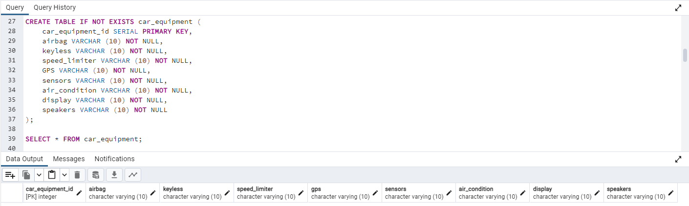
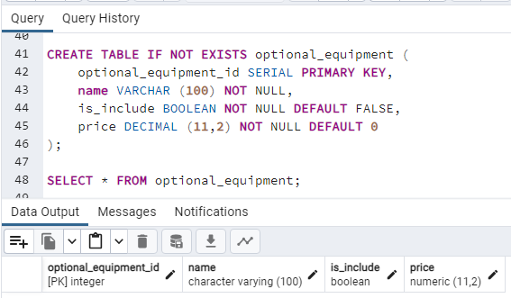
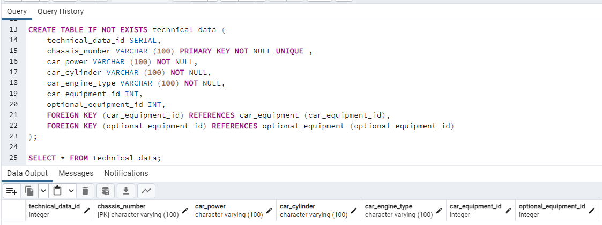
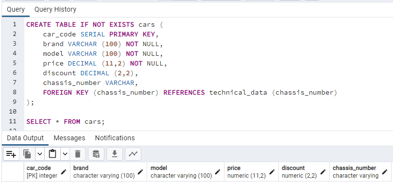
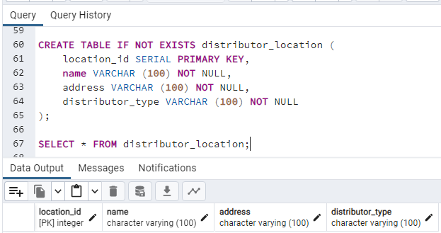
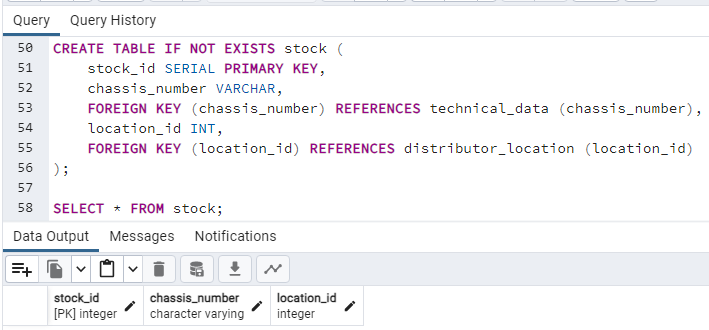
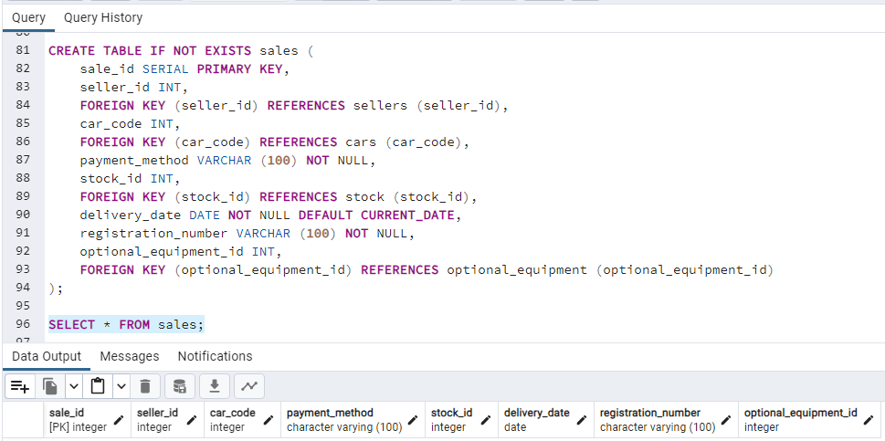
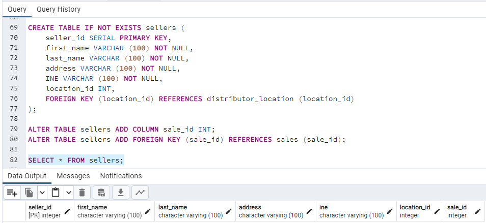

# Ejercicio 3

#### Realizar el modelo entidad-relación, documentar las querys para crear las tablas en PostgreSQL y ejecutarlas.

##### 3.1. Un negocio quiere llevar el *control de piezas* que emplean en el día a día y los *proveedores que suministran* estas. 
1. De cada ***proveedor*** conocemos:
   -   nombre
   -   dirección
   -   ciudad
   -   provincia
   -   y un código de proveedor que será único
2. Nos interesa llevar un control de ***las piezas*** que nos suministra cada proveedor. Es importante conocer:
   - la cantidad de las diferentes piezas que nos suministra 
   - en qué fecha lo hace.
- Tenga en cuenta que un mismo proveedor nos puede suministrar una pieza con el mismo código en diferentes fechas.

El diseño de la base de datos debe permitir:
  - almacenar un ***histórico con todas las fechas***.
  - y las ***cantidades*** que nos ha proporcionado un *proveedor*.
  - Una misma pieza puede ser suministrada por diferentes proveedores.
3. De cada *pieza* conocemos:
     - un código que será único
     - nombre
     - color
     - precio
     - y categoría.
4. Pueden existir varias ***categorías*** y para cada categoría hay:
   - un nombre 
   - un código de categoría único.
- Una pieza solo puede pertenecer a una categoría.

### Solución 3.1:

- Modelo Entidad-Relación:

- Querys - Tablas en PostgreSQL - Ejecución:

##### - Categories:

 
##### - Parts:

##### - Suppliers:

##### - Supplies:

##### 3.2. Se desea diseñar una base de datos que sea de utilidad para *concesionarios de automóviles*.
1. Un concesionario puede vender automóviles de varias marcas.
  - Sobre los **automóviles** se desea mantener la siguiente información:
    - marca
    - modelo
    - precio
    - descuento (si es que lo tiene)
    - datos técnicos
      - potencia fiscal
      - cilindrada
      - etc
2. Para cada modelo de automóvil se quiere conocer las características de su **equipamiento** de serie
    - airbag conductor
    - cierre centralizado
3. Los **extras** que se pueden incluir
      - aire acondicionado
      - airbag acompañante
      - pintura metalizada
      - etc.
      - el precio de cada uno de ellos.

Notar que, lo que son características del equipamiento de serie de algunos modelos, son extras para otros modelos. Por ejemplo, hay modelos que llevan el airbag de serie mientras que otros lo tienen como un posible extra.

4. El concesionario tiene siempre automóviles de varios modelos en **stock**
   - cada uno se identifica por su número de bastidor.
   - Éstos se pueden encontrar en su mismo local
   - o bien, en cualquiera de los servicios oficiales que dependen de él.
  
5. Un servicio oficial es también una tienda de automóviles, pero depende de un **concesionario** que es el que le presta los automóviles para su exposición, y también se los vende. De cada servicio oficial se conoce:
   - el nombre
   - domicilio
   - INE.

6. Cuando se **vende** un automóvil se quiere saber:
- quién lo ha vendido: 
  - puede ser uno de los vendedores del concesionario
  - un servicio oficial. 
- precio que se ha cobrado por él
- modo de pago: 
  - al contado 
  - financiado.
- También se guardará información sobre los extras que se han incluido,
  - precio de cada uno
- fecha de entrega
- matrícula
- si era de stock o se ha tenido que encargar a fábrica.
- De los **vendedores** se almacenarán los datos personales
  - nombre
  - INE
  - domicilio
  - etc.
  - y las ventas realizadas.

### Solución 3.2:

- Modelo Entidad-Relación:

- Querys - Tablas en PostgreSQL - Ejecución:

##### - Car Equipment:

##### - Optional Equipment:

##### - Technical Data:

##### - Cars:

##### - Distributor Location:

##### - Stock:

##### - Sales:

##### - Sellers:

